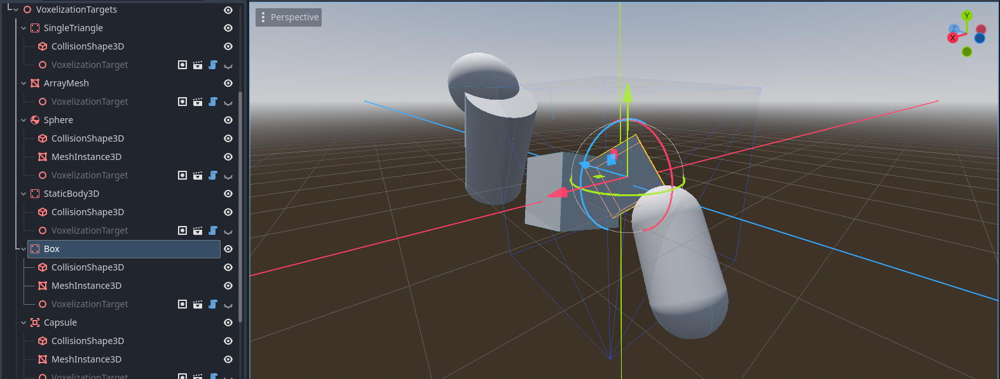
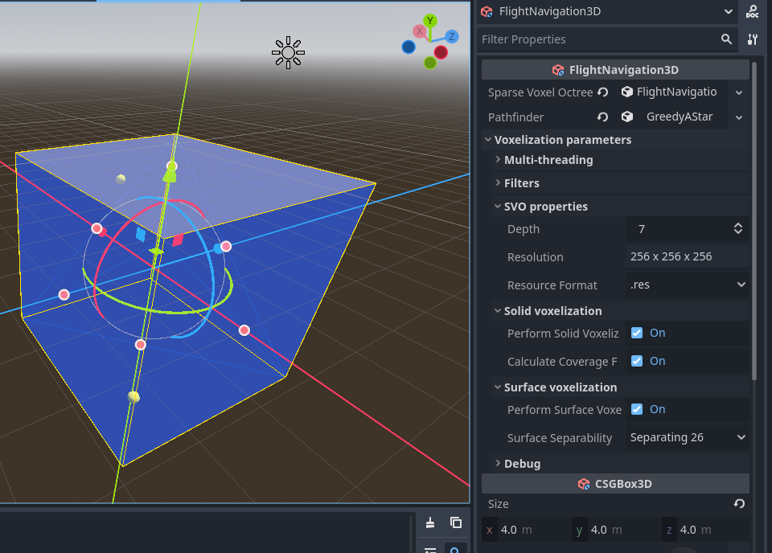
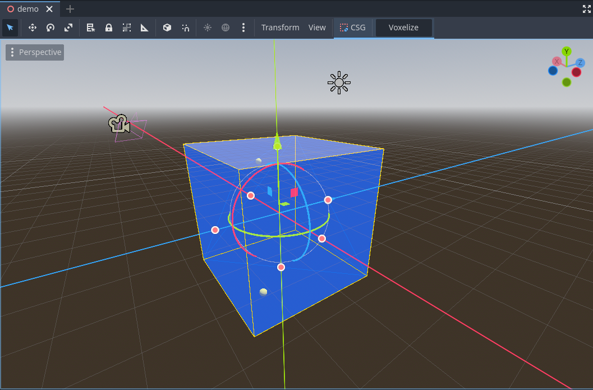
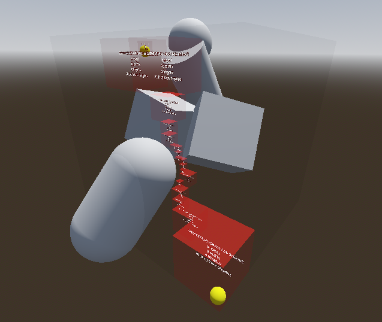
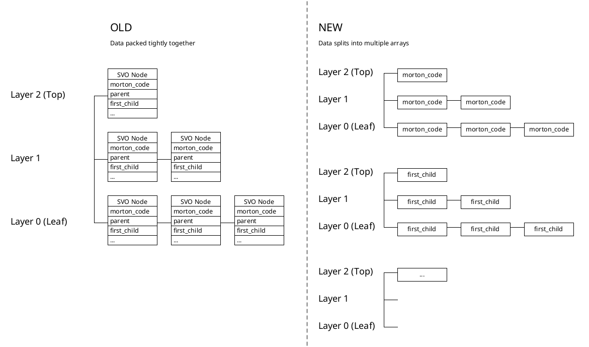

# Godot Flight Navigation 3D 

Godot Flight Navigation 3D provides flying and swimming navigation in free 3D space for Godot Engine. 
It builds a Sparse Voxel Octree (SVO) representing solid and empty space, and applies a Greedy A* algorithm for pathfinding.

## Supported Godot builds:

- Godot_v4.4.1-stable_linux.x86_64

- Godot_v4.5-stable_linux.x86_64

There might actually be more supported builds than listed here. I don't have time to test them out, yet.

## Features

- **Multi-threaded CPU voxelization** for fast processing
- Supports up to **9 layers of voxelization** (512 x 512 x 512) on 8GB RAM
- Works with many node types:
  - All `CollisionObject3D` nodes
  - All `CSGShape3D` nodes
  - Collision shapes: Box, Sphere, Capsule, Cylinder, ConcavePolygon, ConvexPolygon
  - Meshes: BoxMesh, SphereMesh, CapsuleMesh, CylinderMesh, ArrayMesh, TorusMesh
- **Editor integration**: Bake navigation data with a single click
- **Customizable parameters**: Depth, solid voxelization, resource format, etc.
- **Pathfinding API**: Find paths between arbitrary 3D positions
- **Debug visualization**: Draw SVO nodes and voxel occupancy for inspection


## How To Use

### Setup scene


1. **Add `VoxelizationTarget`** as a child to any static obstacle objects.  
   > _Note: All voxelization targets should be static, due to "No runtime update" limitation (see below)._

   

2. **Add a `FlightNavigation3D` node** and set its `CSGBox3D.size` property to encompass your navigation space (ensure all sides are equal).

   


3. Configure parameters for the navigation space. Some important parameters are:

+ `Depth`: controls how detailed the navigation space will be. 
	Memory and computational power consumption rises exponentially per depth level.
	It is recommended to start off small, and then increase depth only when you need finer-grained movement.

+ `Perform Solid Voxelization`: Enables inside/outside detection for navigation.




### Build navigation space

#### Using editor plugin

- Select the `FlightNavigation3D` node.  
- Click the **"Voxelize"** button in the editor toolbar to start the process.
  A progress popup will appear. When finished, the SVO resource will be visible in the Inspector.

  

#### Using GDScript

```gdscript
	var svo = await $FlightNavigation3D.build_navigation()
	$FlightNavigation3D.sparse_voxel_octree = svo

	# Optional: Visualize the navigation space
	$FlightNavigation3D.draw()
```

### Find path between two positions in space

```gdscript
	# find_path works with global positions
	var path = $FlightNavigation3D.find_path($Start.global_position, $End.global_position)

	# Visualize the path
	var svolink_path = Array(path).map(func(pos): return $FlightNavigation3D.get_svolink_of(pos))
	for svolink in svolink_path:
		$FlightNavigation3D.draw_svolink_box(svolink)
```



### Write your own pathfinding algorithm

/TODO/
You can implement your own pathfinding algorithm by extending the [`FlightPathfinder`](src/flight_pathfinder.gd) class.

## Limitations

- **No runtime update**:

By design, the SVO packs data tightly to save space and lookup neighbor quickly.
Thus, addition/removal/transformation of objects inside the navigation space 
cannot be updated easily. You must re-voxelize every time there are 
relative movements of static objects to FlightNavigation3D (which is expensive).

## Future Improvements

- Implement some tips and tricks from paper to speedup voxelization.

- Voxelization using GPU

## Credits

- [Schwarz, M., Seidel, H.-P. 2010. Fast parallel surface and solid voxelization on GPUs. ACM Transactions on Graphics, 29, 6 (Proceedings of SIGGRAPH Asia 2010), Article 179.](http://research.michael-schwarz.com/publ/2010/vox/)

- [Daniel Brewer. 3D Flight Navigation Using Sparse Voxel Octrees.](https://www.gameaipro.com/GameAIPro3/GameAIPro3_Chapter21_3D_Flight_Navigation_Using_Sparse_Voxel_Octrees.pdf)

- [Code reference from Forceflow's CUDA voxelizer](https://github.com/Forceflow/cuda_voxelizer)

## Modifications From Papers

### SVOLink: 32-bit to 64-bit

SVO Link is originally an int32, packed with: 

- Original: 32 bits (4 bits layer, 22 bits node, 6 bits subnode)
- GDScript: 64 bits (4 bits layer, 54 bits node, 6 bits subnode)
- Allows for extremely large navigation spaces.
- It was felt that 54 is a beautiful number that can represent a full space of 2^18 x 2^18 x 2^18 SVO Node.
Such requirements does not exist in real life. Therefore, the number of bits for layer and node index might change in the future.

### Sparse voxel octree structure

Daniel Brewer's approach structures data into layers of SVO Nodes. 
Each node contains all relevant information to it (morton code, link to parents, link to neighbors,...).
Since GDScript does not support `struct` like C++, implementing SVO Node means it has to extends Object (or RefCounted/Resource).
Such implementation in GDScript faces a few drawbacks:

+ Billions of separate SVONode memory allocations would terribly fragments physical memory. 

+ Memory access takes 1 extra pointer jump (for a total of 3).

+ Redundant memory usage (inherited attributes from Object).

+ Sparse Voxel Octree cannot be serialized into Resource in a simple manner.

Drawbacks in general include:

+ SVO Node in the leaf layer has no children, only voxels. 
As such, 1 int64 (SVO Link to first child) of the most crowded layer is wasted for storing nothing.
With 64-bit SVOLink, this attribute can be used to store subgrid mask instead, 
but it makes logic hard to read and maintain.

After 2 overhauls, I have found the most simple data structure to work with GDScript:



Instead of packing all data into 1 big tree, each attribute of SVO Node splits into its own tree.
Each tree is an Array[PackedArray]. The advantages of this approach are:

+ Little redundant memory usage. There's only little extra overhead in arrays management.

+ Memory allocations are contiguous, can be easily pre-allocated.

+ Memory access takes only 2 pointer jumps.

+ Sparse Voxel Octree can be simply serialized, because PackedArray supports serialization.

+ Use only as much memory as needed. 
Things like coverage percentage (implemented in the future) can be turned on and off depending on the need of the game.

The disadvantages are:

+ Accessing data of a single node takes extra time, as its attributes are spread all over the places.
