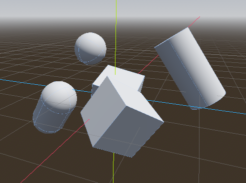

# Godot Flight Navigation 3D 

/In development. Buggy?/

This package provides flying/swimming navigation in free 3D space. It builds a
Sparse Voxel Octree representing the solid/empty state, and then applies Greedy
A* algorithm for path finding.

## General Information

- Tested on Godot versions: 
	+ v4.2.1.stable.official.b09f793f5

## Features

- Multi-threading voxelization on CPU

- Upto 9 layers of voxelization (512 x 512 x 512) on 8GB RAM

- Works with all primitive collision shapes and some complex shapes:
	+ BoxShape3D
	+ SphereShape3D
	+ CapsuleShape3D
	+ CylinderShape3D
	+ ConcavePolygonShape3D

## How To Use

- Set up your scene with collision objects you want to voxelize, and reserve a 
collision layer for them. (Note that all voxelize targets should be objects that 
never move, because of "No runtime update" limitation. See below.)

- Create a FlightNavigation3D, set its collision mask to include the voxelize 
objects' mask, and set $Extent.shape.size property. For the size property, you can
do it either in code or in editor (recommended) by right-click FlightNavigation3D
object > Enable "Editable children".

- Call FlightNavigation3D.voxelize() or voxelize_async() with the depth you want.

	+ Two voxelize methods must not be called at your root scene's _ready(),
	because they need a physic frame or two to detect all overlapping bodies and areas.
	
	+ Voxelization might take a long time depending on host machine. It's recommended
	to use voxelize_async(), which uses multithreading at low priority.
	
- Call find_path() anytime to get a connected path between two points inside FlightNavigation3D
space. Here's an illustration of the result. The boxes are drawn with debug methods
FlightNavigation3D.draw_svolink_box() (draw an arbitrary box) and 
FlightNavigation3D.draw_debug_boxes() (draw all leaf voxels of the SVO)

### Warning

To be able to voxelize a map right in the editor, PhysicsServer3D is set active
for the FlightNavigation3D to detect overlapping bodies and areas. It could cause
you editor-wide problems, like objects set afloat in the scene suddenly drop to the 
ground. 

There are some ways you can try to work around this problem:
	
- Make sure you don't save the ill-affected scenes if it happens.
- Try to open only the scene of map you need to voxelize and nothing else.
 

### Write your own pathfinding algorithm

/TODO/

## Limitations

- No runtime update

By design, the SVO packs data tightly to save space and quick neighbor lookup.
Thus, addition/removal/transformation of objects inside the navigation space 
cannot be updated trivially, and you must re-voxelize the space every time. 

- No inside/outside state.

The SVO doesn't store information or provide a way to figure out whether a position
is inside an object. This could be a future improvement.

## Future Improvements

- Save/load SVO into Resource file and voxelize in the editor. (UI is ready, but
implementation for ResourceFormatSaver/Loader encounters error).

- Implement some tips and tricks from paper to speedup voxelization.

- GPU voxelization (? uhhhh I'll figure this out later).

- Add supports for more collision shape:
	+ ConvexPolygonShape3D
	
		Currently there's no trivial way in Godot to convert ConvexPolygonShape3D's
		set of points into an ArrayMesh to get triangles
		
	+ HeightMap3D
	+ SeparationRay3D
	+ WorldBoundaryShape3D

## Credits

- Schwarz, M., Seidel, H.-P. 2010. Fast parallel surface and solid voxelization on GPUs. ACM Transactions on Graphics, 29, 6 (Proceedings of SIGGRAPH Asia 2010), Article 179: http://research.michael-schwarz.com/publ/2010/vox/

- 3D Flight Navigation Using Sparse Voxel Octrees, Daniel Brewer: https://www.gameaipro.com/GameAIPro3/GameAIPro3_Chapter21_3D_Flight_Navigation_Using_Sparse_Voxel_Octrees.pdf

- Forceflow's code on triangle/box test, without whom I would have been stuck,
	jerking hair out of my head wondering why my overlap test doesn't work:
	https://github.com/Forceflow/cuda_voxelizer/blob/main/src/cpu_voxelizer.cpp

### Modifications From Papers
/TODO/
