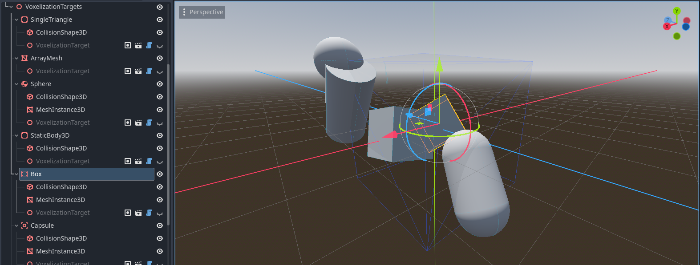
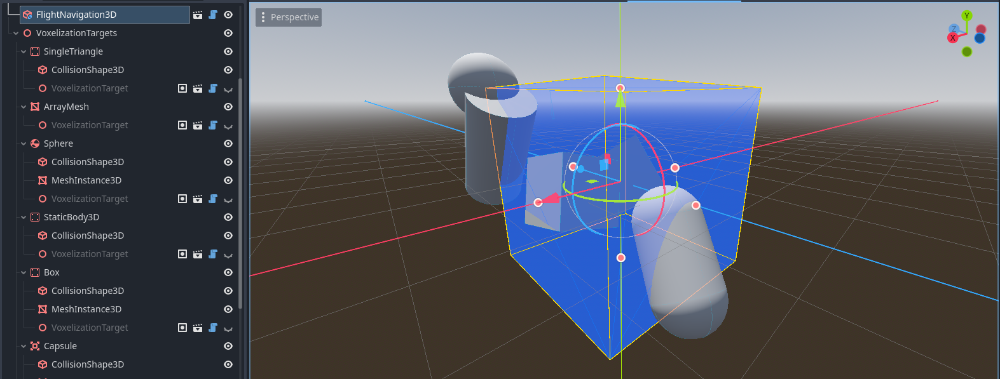
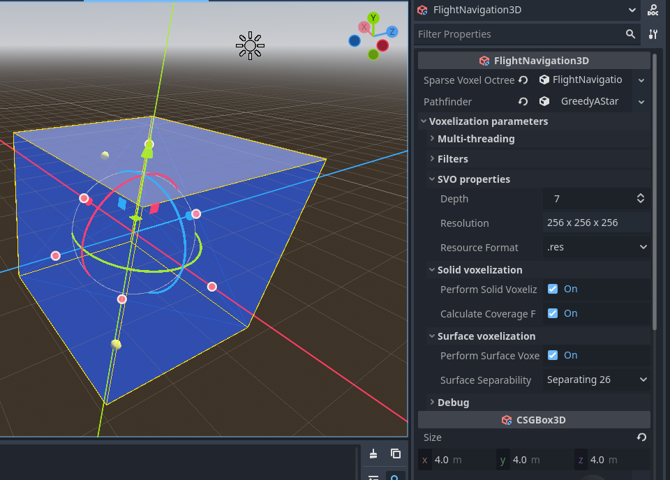
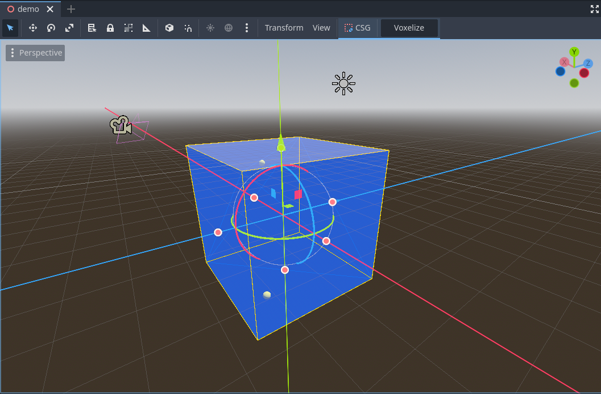
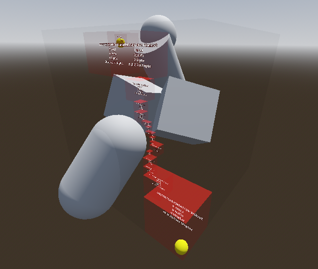

# Godot Flight Navigation 3D

Godot Flight Navigation 3D provides flying and swimming navigation in free 3D space for Godot Engine.
It builds a Sparse Voxel Octree (SVO) representing solid and empty space, then runs a pathfinder such as `GreedyAStar` to connect points in 3D.

## Supported Godot builds

- `Godot_v4.4.1-stable_linux.x86_64`
- `Godot_v4.5-stable_linux.x86_64`

Other Godot 4 builds may also work, but they are not explicitly verified here yet.

## Documentation map

- This file explains setup, workflow, and important behavior.
- `docs/API_REFERENCE.md` contains the consolidated class and API reference.
- `tests/` acts as executable behavior documentation for many edge cases and regressions.

## Features

- Multi-threaded CPU voxelization for faster preprocessing
- Supports up to 9 SVO layers (`512 x 512 x 512` node space on the current implementation target)
- Works with many obstacle sources through `VoxelizationTarget`
  - `CollisionObject3D`
  - `CollisionShape3D`
  - `MeshInstance3D`
  - `CSGShape3D`
- Supported collision shapes and meshes include:
  - `Box`
  - `Sphere`
  - `Capsule`
  - `Cylinder`
  - `ConcavePolygon`
  - `ConvexPolygon`
  - `ArrayMesh`
  - `TorusMesh`
- Editor integration for one-click baking
- Script API for baking, coordinate conversion, and path queries
- Debug visualizers for nodes, links, and subgrid voxels

## Quick start

### 1. Mark voxelization sources

Add `VoxelizationTarget` as a child of each static obstacle source that should contribute to the navigation volume.

> `VoxelizationTarget` is intended for static geometry. Runtime obstacle edits still require a rebuild.



### 2. Add the navigation volume

Add a `FlightNavigation3D` node and configure its `CSGBox3D.size` so it encloses the navigable region.
For best results, keep the volume cubic.



### 3. Add exactly one voxelizer child

`FlightNavigation3D.build_navigation()` expects exactly one child implementing `ASvoVoxelizer`.
The stock choice is `SvoVoxelizer`.

Important configuration options on the voxelizer include:

- `layer_count`: Higher values increase detail and memory cost exponentially.
- `solid_voxelization_enabled`: Enables inside/outside information, which is required for robust solid queries.
- `surface_voxelization_enabled`: Enables boundary rasterization.
- `support_float64`: Enables the float64 triangle-box implementation, which may help some precision-sensitive cases but still starts from Godot-side float32 geometry data.



## Building navigation data

### Using the editor plugin

- Select the `FlightNavigation3D` node.
- Click the **Voxelize** toolbar button.
- Wait for the bake to finish.
- The generated `SVO` resource will be assigned to `sparse_voxel_octree`.



### Using GDScript

```gdscript
await $FlightNavigation3D.build_navigation()

# Optional debug draw
await $FlightNavigation3D.draw()
```

Behavior notes:

- `build_navigation()` is asynchronous and must be awaited.
- It assigns the returned `SVO` to `FlightNavigation3D.sparse_voxel_octree`.
- If there is not exactly one child voxelizer, the method prints an error and leaves the current resource unchanged.

## Finding a path

```gdscript
# find_path() works in global coordinates
var path: PackedVector3Array = $FlightNavigation3D.find_path(
	$Start.global_position,
	$End.global_position
)

if not path.is_empty():
	var svolink_path := Array(path).map(
		func(pos: Vector3) -> int:
			return $FlightNavigation3D.get_svolink_of(pos)
	)
	for svolink in svolink_path:
		$FlightNavigation3D.draw_svolink_box(svolink)
```



`find_path()` returns an empty array when:

- no `sparse_voxel_octree` is assigned
- no `pathfinder` resource is assigned
- either endpoint lies outside the navigation volume
- either endpoint resolves to a null `SVOLink`
- either endpoint is solid
- the selected pathfinder fails to find a route

The solid-endpoint rejection is intentional and now covered by tests.

## Extending pathfinding

Create a custom resource that extends `FlightPathfinder`, then assign it to `FlightNavigation3D.pathfinder`.

At minimum, override:

- `_find_path(from, to, svo)`

Optional customization points include:

- `_compute_cost(start, destination, svo)`
- `_estimate_cost(start, destination, svo)`

See `docs/API_REFERENCE.md` for the public contract and helper methods.

## Important caveats and current behavior

### Confirmed behavior

- `build_navigation()` must be awaited and requires exactly one child voxelizer.
- `find_path()` rejects solid start and goal voxels rather than pathing from inside geometry.
- `GreedyAStar.endpoints` currently supports only `Voxel Centers`.
- Legacy serialized `Face Centers` values are normalized back to `Voxel Centers` instead of being honored.

### Known limitations

- **No runtime incremental updates**  
  The SVO is tightly packed and optimized for queries, not live edits. Moving or changing static geometry requires rebuilding the navigation resource.

- **`FlightPathfinder.get_closest_faces()` is not implemented**  
  It currently warns once and falls back to node/voxel centers.

- **`GreedyAStar.use_unit_cost` remains experimental**  
  The code explicitly marks it as TODO, so treat non-default tuning carefully.

- **`GreedyAStar.w` needs caution**  
  The current source comments note that setting `w = 2` can freeze the search.

- **Float precision still needs more investigation**  
  The project exposes float32 and float64 triangle-box implementations, but Godot geometry inputs are still float32-based. Remaining rasterization divergence between float32 and float64 paths should be treated as an open investigation area rather than a solved guarantee.

- **Boundary precision can still matter**  
  `FlightNavigation3D.get_svolink_of()` documents that points landing exactly on faces may map differently because of floating-point error.

- **`MultiMeshInstance3D` voxelization is still stubbed out**  
  `VoxelizationTarget` recognizes the parent type but currently returns no generated CSG for it.

## Main runtime architecture

| Class | Role |
| --- | --- |
| `FlightNavigation3D` | Scene node that owns the navigation volume, baked SVO resource, and pathfinder resource |
| `ASvoVoxelizer` / `SvoVoxelizer` | Baking pipeline that converts scene geometry into an `SVO` |
| `ASvo` / `SVO` | Packed sparse voxel octree storage and query API |
| `FlightPathfinder` / `GreedyAStar` | Pathfinding resource abstraction and default implementation |
| `VoxelizationTarget` | Marks scene geometry that should be converted into CSG for voxelization |
| `Fn3dLookupTable` | Shared lookup tables for faces, child ordering, and bit operations |
| `SvoLink32` / `SvoLink64` | Packed link encodings for nodes and subgrid voxels |
| `ATriangleBoxOverlapCheck` family | Surface/solid voxelization triangle-box overlap tests |
| `ASvoVisualizer` family | Optional debug drawing helpers |

For class-by-class details, see `docs/API_REFERENCE.md`.

## Credits

- [Schwarz, M., Seidel, H.-P. 2010. Fast parallel surface and solid voxelization on GPUs. ACM Transactions on Graphics, 29, 6 (Proceedings of SIGGRAPH Asia 2010), Article 179.](http://research.michael-schwarz.com/publ/2010/vox/)
- [Daniel Brewer. 3D Flight Navigation Using Sparse Voxel Octrees.](https://www.gameaipro.com/GameAIPro3/GameAIPro3_Chapter21_3D_Flight_Navigation_Using_Sparse_Voxel_Octrees.pdf)
- [Code reference from Forceflow's CUDA voxelizer](https://github.com/Forceflow/cuda_voxelizer)

## Notes on implementation differences from referenced papers

### `SVOLink`: 32-bit to 64-bit

The original paper-oriented link packing assumes a 32-bit representation.
This project also provides a 64-bit representation with significantly more room for node offsets.

- Original reference: 32 bits (`4 bits layer`, `22 bits node`, `6 bits subnode`)
- Project `SvoLink64`: 64 bits (`4 bits layer`, `54 bits node`, `6 bits subgrid`)

This keeps the implementation practical for large scenes and convenient in GDScript.

### Packed-array SVO storage instead of per-node objects

Rather than storing each node as a separate object, this project stores SVO attributes in parallel packed arrays.
This design is easier to serialize in Godot resources and avoids the allocation overhead of huge object graphs.

Main trade-offs:

- Better serialization and memory locality
- Less object overhead
- Faster bulk allocation
- More indirect access when inspecting all attributes of one logical node
